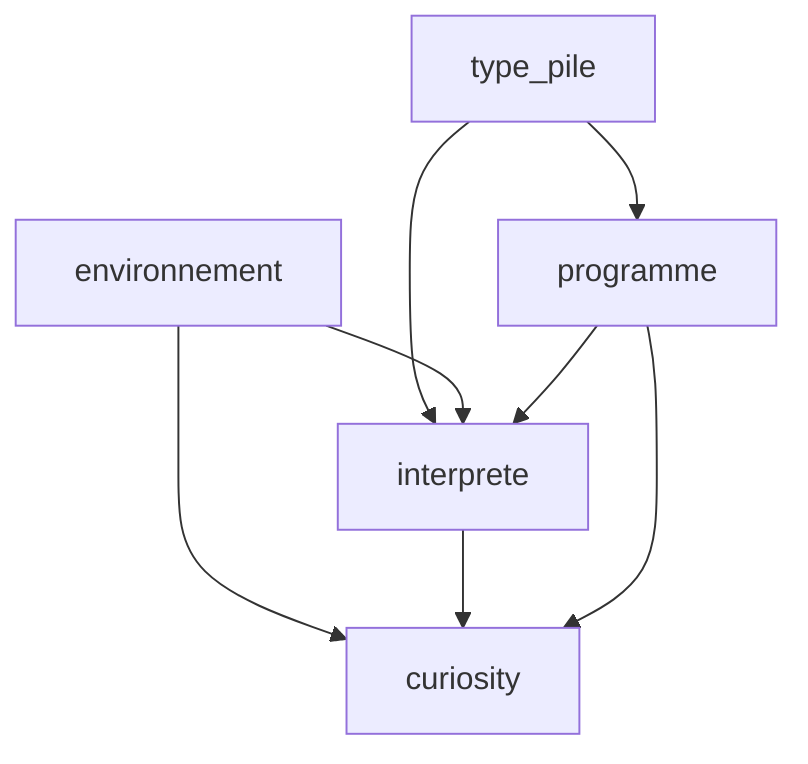

# Curiosity Revolution

## Présentation
Ce dépôt contient des exercices et des tests pour le projet *Curiosity* (interpréteur / simulation d’un robot sur un terrain).
Les fichiers sources (modules en C) incluent : `environnement`, `interprete`, `programme`, `robot`, `terrain`, `type_pile`.

# TP5

## Exo.1 et 2
Écriture et test de `terrain.c` et `test_terrain.c`.

## Exo.3
Écriture et test de `robot.c`.

## Exo.4
Écriture et test de `robot_terrain`.  
Dans les dossiers `Terrains_Corrects` et `Terrains_Incorrects`, vous trouverez des terrains d'exemple pour les tests.  

Pour exécuter le programme de test :
```bash
make robot_terrain
./robot_terrain <fichier_terrain>
```

# TP6 

## Exo.1 — Tests unitaires (script)
Les tests de base pour plusieurs terrains et programmes se trouvent dans le dossier `test_curiosity`.
Pour lancer tous les tests du dossier, utilisez (depuis la racine du projet) :

```bash
./test_curiosity/tests_curiosity.sh
```

Ce script exécute l’exécutable `curiosity` sur plusieurs couples `(terrain, programme)` et affiche les résultats.

## Exo.2 et 3 — Tests fonctionnels pour `curiosity-test`
J’ai ajouté plusieurs fichiers de test pour couvrir les cas finaux possibles du robot. Chaque fichier `test_*.txt` a le format suivant :

```
<nom_fichier_terrain>
<nom_fichier_programme>
<max_steps>
<evenement_attendu>          # un caractère : N, F, S, O, ou P
[<x> <y>]                    # optionnel : si evenement = N ou F, coordonnées attendues
[<orientation>]              # optionnel : si evenement = N ou F, coordonnées attendues
```

Signification des événements attendus :
- `N` — position normale (robot OK à l'intérieur du terrain),
- `F` — le programme est terminé (arrêt normal),
- `S` — le robot est sorti du terrain (sortie),
- `O` — le robot a rencontré un obstacle (crash),
- `P` — le robot est tombé dans l’eau (plouf).

Exemple de lancement d’un test individuel (depuis la racine) :

```bash
./curiosity-test test_plouf.txt
```

## Tests fournis
Les tests ajoutés couvrent les cas principaux :

- `test_plouf.txt` → `terrain_plouf.txt` + `prog_plouf.prg` (événement attendu `P`)
- `test_crash.txt` → `terrain_crash.txt` + `prog_crash.prg` (événement attendu `O`)
- `test_sortie.txt` → `terrain_sortie.txt` + `prog_sortie.prg` (événement attendu `S`)
- `test_arret.txt` → `terrain_arret.txt` + `prog_arret.prg` (événement attendu `F`)
- `test_normal.txt` → `terrain_normal.txt` + `prog_normal.prg` (exemple pour `N`)


## Exécuter tous les tests `curiosity-test`
Pour exécuter tous les fichiers `test_*.txt` utiliser `run_all_curiosity_tests.sh` 
```bash
./curiosity-test.sh
```
## Exo.4 — Test de tous les interprètes
Pour exécuter tous les tests pour tous les interprètes, lancez le script:
```bash
run_all_curiosity_tests.sh.
```
et avec utilisation de diff interprete.c interprete?.c on vois que 

interprete0.c : issue with cas Clone on a deux fois: empiler(&(etat->stack), a) donc on clone a deux fois

interprete1.c : OK

interprete2.c : issue with cas Echange on a empiler(&(etat->stack), b) et apres empiler(&(etat->stack), a) donc on ne change pas l'ordre d'elements

interprete3.c :  issue with cas Mesure on a mes = mesure_envt(envt, param % 8); et pas mes = mesure_envt(envt, param);

interprete4.c : issue with cas CondExec on a apres addr_v = sommet(&(etat->stack)); coś takiego addr_f = addr_v;

interprete5.c : issue with cas DebutBlock on a dex fois empiler(&(etat->stack), etat->pc + 1);

interprete6.c : dans switch(res) pour les cas PLOUF et CRASH les retours sont inverses

interprete7.c : OK

interprete8.c : issue with cas Boucle dans if on a n>=0 et pas n>0

interprete9.c : issue with cas Sub on a empiler(&(etat->stack), a-b): et pas b-a 


## Exo.5 — Tests de robustesse de l'interprète

### 1) Erreurs détectées à la lecture du programme (fonction `lire_programme` dans `programme.c`)

Lors de la lecture d'un fichier programme, on peut rencontrer les erreurs
suivantes :

- `ERREUR_FICHIER_PROGRAMME` — le fichier n'a pas pu être ouvert.
- `ERREUR_BLOC_NON_FERME` — la fin du fichier apparaît alors que des `{`
  restent non appariés.
- `ERREUR_FERMETURE_BLOC_EXCEDENTAIRE` — une `}` sans `{` correspondante.
- `ERREUR_COMMANDE_INCORRECTE` — un caractère/commande non reconnu.

Exemple :

- `prog_read_error.prg` (contenu : `@`) — attendu : `ERREUR_COMMANDE_INCORRECTE`.

### 2) Erreurs détectées à l'exécution (fonction `exec_pas` dans `interprete.c`)

Pendant l'exécution des instructions, l'interpréteur peut renvoyer :

- `ERREUR_PILE_VIDE` — une opération nécessitant des éléments sur la pile
  a été effectuée alors que la pile était vide.
- `ERREUR_ADRESSAGE` — le compteur de programme (pc) devient invalide.
- `ERREUR_DIVISION_PAR_ZERO` — tentative de division par zéro.

Exemple :

- `prog_divzero.prg` (contenu : `5 0 /`) — l'exécution produit `ERREUR_DIVISION_PAR_ZERO`.

## Exo.6 — Tests de robustesse de l'interprète (bonus)

Dans `type_pile.h`, la pile a une capacité fixe définie par `#define TAILLE_MAX 100`.
Toutefois, l'implémentation actuelle ne vérifie pas cette borne :

Donc il est possible d'écrire des programmes incorrects (par exemple un fichier contenant 200 `1`) qui seront lus et interprétés sans que le paquetage ne retourne l'une des erreurs prévues : le comportement devient indéfini (corruption mémoire, plantage ou résultats erratiques) au lieu d'une erreur contrôlée.

# TP7 

## Exo.1 / Exo.2

Compléter la fonction `generation_aleatoire` du module `generation_terrains`.  
Compléter le programme `test_generation_terrains.c` afin de générer plusieurs terrains et d'écrire ces terrains, ainsi que leurs statistiques, dans un fichier de résultat.

Usage de `test_generation_terrains` :  
Usage : %s <N> <largeur> <hauteur> <densite_obstacle> <fichier_res>

## Exo.3

`curiosity-perf fichier_programme N L H d graine nb_step_max fichier_res`

avec affichage des statistiques dans la console

## Exo.4
Programmes permettant au robot de tenter de sortir de n'importe quel terrain:

**ficher_programme_1.txt :**
avance indéfiniment  
{ A C ! } C !

**ficher_programme_2.txt :**  
mesure la case devant et avance si elle est libre, tourne à gauche s'il y a un obstacle  
{ 1 M { G } { A } ? C ! } C !

**ficher_programme_3.txt :**  
évite les obstacles en tournant à droite :  
{ M { A } { D } ? C ! } C !

**ficher_programme_4.txt :**
tourne jusqu'à trouver une case libre, puis avance
Logique : mesure l'avant (1 M). Si obstacle → tourne à gauche (G) et recommence immédiatement la boucle (mesure à nouveau). Si libre → avance 
{ 1 M { G C ! } { A C ! } ? } C !

## Exo.5 

**ficher_programme_1.txt :**
Description : “avance indéfiniment” — ne change jamais de direction.
Terrain où il sortira (S) :
Ligne 1×5 :
C . . . .
Explication : il avance en ligne droite jusqu’à dépasser la bordure → SORTIE.
Terrain où il se bloque ou crash (O) :
Ligne 1×3 :
C # .
Explication : il essaie d’avancer, rencontre # → CRASH.
Caractéristique : marche seulement si la direction de départ contient une route libre continue vers la bordure. Ne sait pas détourner d’un obstacle.

**ficher_programme_2.txt :**  
Programme (résumé) : mesure devant (1 M) ; si obstacle → G (gauche), sinon → A (avancer). Boucle.
Terrain où il sortira (S) :
Exemple de petit labyrinthe où la règle “tourne à gauche si bloqué” finit par mener à la bordure.
Terrain où il reste bloqué (boucle) :
Exemple : robot au centre entouré par un anneau de rochers (ou configuration provoquant un cycle de trajectoire).
Caractéristique : algorithme réactif avec biais gauche. Résout certains labyrinthes mais peut entrer dans des cycles locaux (ne possède pas de mémoire globale).

**ficher_programme_3.txt :** 
Comme 2 mais avec biais droit (D au lieu de G).
Caractéristique : symétrique du programme 2 ; certains labyrinthes résolus par 2 peuvent échouer pour 3 et inversement.

**ficher_programme_4.txt :**
Programme (résumé) : mesurer l’avant (1 M) ; si obstacle → tourner à gauche et réessayer ; si libre → avancer. (Tourne jusqu’à trouver une case libre, puis avance.)
Terrain où il sortira :
Si le graphe de cases libres est connecté vers la bordure, le robot finira par atteindre la bordure en explorant localement.
Terrain bloquant :
Si le robot est dans une région complètement entourée par obstacles (pas de chemin vers l’extérieur) → il tournera ou bouclera sans sortie. Peut aussi tourner indéfiniment autour d’un motif.
Caractéristique : ce programme est robuste localement (trouve toujours un voisin libre si existe), mais n’échappe pas aux pièges globaux (cycles, îles fermées).

## Exo.6

changer #define TAILLE_MAX 100 en #define TAILLE_MAX 100000

tests sur ficher_prog3 et ficher_prog4 :

1) statistiques pour: 
`curiosity-perf fichier_programme_3.txt 20 25 25 0.4 10000 10000 fichier_res_3_25.txt`

Terrains: 20
Sorties : 0 (0.00%)
Bloqués : 13 (65.00%)
Plouf (eau) : 1 (5.00%)
Crash (rocher) : 6 (30.00%)
Aucune sortie, moyenne pas non disponible


`curiosity-perf fichier_programme_4.txt 20 25 25 0.4 10000 10000 fichier_res_4_25.txt`

Terrains: 20
Sorties : 1 (5.00%)
Bloqués : 19 (95.00%)
Plouf (eau) : 0 (0.00%)
Crash (rocher) : 0 (0.00%)
Moyenne pas pour sorties : 209.00

2) statistiques pour: 
`curiosity-perf fichier_programme_3.txt 20 9 9 0.7 10000 10000 fichier_res_3_9.txt`

Terrains: 20
Sorties : 0 (0.00%)
Bloqués : 10 (50.00%)
Plouf (eau) : 2 (10.00%)
Crash (rocher) : 8 (40.00%)
Aucune sortie, moyenne pas non disponible


`curiosity-perf fichier_programme_4.txt 20 9 9 0.7 10000 10000 fichier_res_4_9.txt`

Terrains: 20
Sorties : 5 (25.00%)
Bloqués : 15 (75.00%)
Plouf (eau) : 0 (0.00%)
Crash (rocher) : 0 (0.00%)
Moyenne pas pour sorties : 66.60

# TP8

## Exo.1 / Exo.2 / Exo.3

implementation de paquetage observateur: observateur.h observateur.c et motdyfication du paquetage environement
implementation of curiosity-obs.c

## Exo.4

Tester le programme curiosity-obs sur différents terrains et programmes. En particulier, écrire des terrains et programmes pour les catégories d'exemples vus en CTD :

    des programmes-robots corrects, acceptés par l'observateur ;
    des programmes-robots incorrects, rejetés par l'observateur ;
    des programmes-robots corrects, rejetés par l'observateur ;
    des programmes-robots incorrects, acceptés par l'observateur.

## Exo.5


## Structure du programe (rapide)
